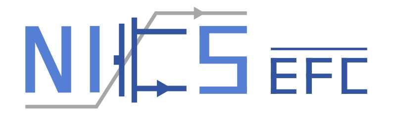
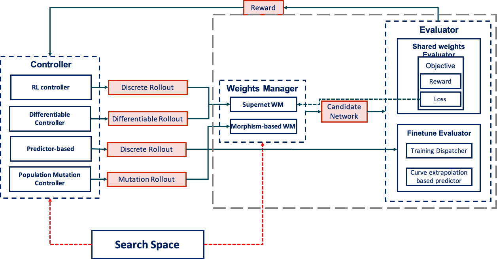

# aw_nas: A Modularized and Extensible NAS Framework

<p align="middle">
  
  
</p>

Maintained by [NICS-EFC Lab](https://nicsefc.ee.tsinghua.edu.cn/) (Tsinghua University) and [Novauto Technology Co. Ltd.](https://www.novauto.com.cn/) (Beijing China).

## Introduction

Neural Architecture Search (NAS) has received extensive attention due to its capability to discover neural network architectures in an automated manner. `aw_nas` is a NAS framework with various NAS algorithms implemented in a modularized manner. Currently, `aw_nas` can be used to reproduce the results of many mainstream NAS algorithms, e.g., ENAS, DARTS, SNAS, FBNet, OFA, predictor-based NAS, etc. And we have applied NAS algorithms for various applications & scenarios with `aw_nas`, including NAS for classification, detection, text modeling, hardware fault tolerance, adversarial robustness, hardware inference efficiency, and so on.

Also, the hardware-related profiling and parsing interface is designed to be general and easily-usable. Along with the flow and interface, `aw_nas` provides the latency table and some correction model of multiple hardware. See [Hardware related](doc/hardware.md) for more details.

**Contributions are all welcome**, including new NAS component implementation, new NAS applications, bug fixes, documentation, and so on.

### Components of a NAS system

There are multiple actors that are working together in a NAS system, and they can be categorized into these components:

* search space
* controller
* weights manager
* evaluator
* objective


The interface between these components is somehow well-defined. We use a class `awnas.rollout.base.BaseRollout` to represent the interface object between all these components. Usually, a search space defines one or more rollout types (a subclass of `BaseRollout`). For example, the basic cell-based search space `cnn` (class `awnas.common.CNNSearchSpace`) corresponds to two rollout types: `discrete`discrete rollouts that are used in RL-based, EVO-based controllers, etc. (class `awnas.rollout.base.Rollout`); `differentiable` differentiable rollouts that are used in gradient-based NAS (class `awnas.rollout.base.DifferentiableRollout`).



Here is a graphical illustration of the [NAS flow and corresponding method calls](doc/pics/flow.pdf). And here is [a brief technical summary](doc/awnas.pdf) of `aw_nas`, including some reproducing results and descriptions on hardware cost prediction models. This technical summary is also available on [arXiv](https://arxiv.org/abs/2012.10388) (Github/ArXiv versions might slighly differ).


## Install

Using a virtual python environment is encouraged. For example, with Anaconda, you could run `conda create -n awnas python==3.7.3 pip` first.

* Supported python versions: 2.7, 3.6, 3.7
* Supported Pytorch versions: >=1.0.0, <1.5.0 (Currently, some patches in DataParallel replication is not compatible after 1.5.0)

To install `awnas`, run `pip install -r requirements.txt`. If you do not want to install the detection extras (required for running search on detection datasets VOC/COCO), omit the ",det" extras during the installation (See the last line in the [requirements file](requirements.txt)). Note that for RTX 3090, `torch==1.2.0` in `requirements.txt` no longer works: using `torch` would lead to permanent stuck. Check the comments in `requirements.cu110.txt`.

Architecture plotting depends on the `graphviz` package, make sure `graphiz` is installed, e.g. on Ubuntu, you can run `sudo apt-get install graphviz`.

## Usage

After installation, you can run `awnas --help` to see what sub-commands are available.

Output of an example run (version 0.3.dev3):

```
07/04 11:41:44 PM plugin              INFO: Check plugins under /home/foxfi/awnas/plugins
07/04 11:41:44 PM plugin              INFO: Loaded plugins:
Usage: awnas [OPTIONS] COMMAND [ARGS]...

  The awnas NAS framework command-line interface. Use `AWNAS_LOG_LEVEL`
  environment variable to modify the log level.

Options:
  --version             Show the version and exit.
  --local_rank INTEGER  the rank of this process  [default: -1]
  --help                Show this message and exit.

Commands:
  search                   Searching for architecture.
  mpsearch                 Multiprocess searching for architecture.
  random-sample            Random sample architectures.
  sample                   Sample architectures, pickle loading controller...
  eval-arch                Eval architecture from file.
  derive                   Derive architectures.
  mptrain                  Multiprocess final training of architecture.
  train                    Train an architecture.
  test                     Test a final-trained model.
  gen-sample-config        Dump the sample configuration.
  gen-final-sample-config  Dump the sample configuration for final training.
  registry                 Print registry information.
```

### Prepare data

When running `awnas` program, it will assume the data of a dataset with `name=<NAME>` under `AWNAS_DATA/<NAME>`, in which `AWNAS_DATA` base directory is read from the environment variable `AWNAS_DATA`. If the environment variable is not specified, the default is `AWNAS_HOME/data`, in which `AWNAS_HOME` is an environment variable default to be `~/awnas`.

* Cifar-10/Cifar-100: No specific preparation needed.
* PTB: `bash scripts/get_data.sh ptb`, the ptb data will be downloaded under `${DATA_BASE}/ptb` directory. By default `${DATA_BASE}` will be `~/awnas/data`.
* Tiny-ImageNet: `bash scripts/get_data.sh tiny-imagenet`, the tiny-imagenet data will be downloaded under `${DATA_BASE}/tiny-imagenet` directory.
* Detection datasets VOC/COCO: `bash scripts/get_data.sh voc` and `bash scripts/get_data.sh coco`

### Run NAS search

**ENAS** Try running an ENAS [Pham et. al., ICML 2018] search (the results (including configuration backup, search log) in `<TRAIN_DIR>`):

```
awnas search examples/basic/enas.yaml --gpu 0 --save-every <SAVE_EVERY> --train-dir <TRAIN_DIR>
```

There are several sections in the configuration file that describe the configurations of different components in the NAS framework. For example, in `example/basic/enas.yaml`, different configuration sections are organized as follows:

1. a cell-based CNN **search space**: The search space is an extended version from the 5-primitive micro search space in the original ENAS paper.
2. cifar-10 **dataset**
3. RL-learned **controller** with the `embed_lstm` RNN network
4. shared weights based **evaluator**
5. shared weights based **weights manager**: super net
6. classification **objective**
7. **trainer**: the orchestration of the overall NAS search flow

For a detailed breakup of the ENAS search configuration, please refer to the [config notes](./doc/enas_cfg_notes.md).

**DARTS** Also, you can run an improved version of DARTS [Liu et. al., ICLR 2018] search by running:

```
awnas search examples/basic/darts.yaml --gpu 0 --save-every <SAVE_EVERY> --train-dir <TRAIN_DIR>
```
We provide a walk-through of the components and flow [here](./doc/darts_flow.md). Note that this configuration is a little different from the original DARTS in that 1) `entropy_coeff: 0.01`: An entropy regularization
coefficient of 0.01 is used, which encourage the op distribution to be more close to one-hot; 2) `use_prob: false`: Gumbel-softmax sampling is used, instead of directly using the probability.

**Results Reproduction** For the exact reproduction of the results of various popular methods, see the doc, configuration, and results under [`examples/mloss/`](./examples/mloss).

#### Generate sample search config
To generate a sample configuration file for searching, try ``awnas gen-sample-config`` utility. For example, if you want a sample search configuration for searching on NAS-Bench-101, run

```
awnas gen-sample-config -r nasbench-101 -d image ./sample_nb101.yaml
```

Then, check the `sample_nb101.yaml` file, for each component type, all classes that declare to support the `nasbench-101` rollout type would be listed in the file. Delete those you do not need, uncomment those you need, change the default settings, and then that config can be used to run NAS on NAS-Bench-101.

### Derive & Eval-arch

The `awnas derive` utility sample architecture using the trained NAS components. If the `--test` flag is off (default), only the controller is loaded to sample rollouts; Otherwise, the weights manager and trainer are also loaded to test these rollouts, and the sampled genotypes will be sorted according to the performances in the output file.

An example run is to sample 10 genotypes, and save them into `sampled_genotypes.yaml`.
```
awnas derive search_cfg.yaml --load <checkpoint dir dumped during awnas search> -o sampled_genotypes.yaml -n 10 --test --gpu 0 --seed 123
```

> Note that, the files "controller/evaluator/trainer" in the `<TRAIN_DIR>/<EPOCH>/` folders contain the state dict of the components, and can be loaded (dumped every `<SAVE_EVERY>` epochs), while the final checkpoints "controller.pt/evaluator.pt" in the "<TRAIN_DIR>/final/" folder contains a whole pickle of the component object, and can not be directly loaded. If you forget to specificy `--save-every` cmdline arguments and do not get state-dict checkpoints, you could load the final checkpoint and then dump the needed state dict ckpt by `cd <TRAIN_DIR>/final/; python -c "controller = torch.load('./controller.pt'); controller.save('controller')"`.

The `awnas eval-arch` utility evaluate genotypes using the trained NAS components. Given a yaml file containing a list of genotypes, one can evaluate these genotypes using the saved NAS checkpoint:
```
awnas eval-arch search_cfg.yaml sampled_genotypes.yaml --load <checkpoint dir dumped during awnas search> --gpu 0 --seed 123
```

### Final Training of Cell-based Architecture

The `awnas.final` sub-package provides the final training functionality of cell-based architectures. `examples/basic/final_templates/final_template.yaml` is a commonly-used configuration template for final training architectures in an ENAS-like search space. To use that template, fill the ``final_model_cfg.genotypes` field with the genotype string derived from the search process. A genotype string example is
```
CNNGenotype(normal_0=[('dil_conv_3x3', 1, 2), ('skip_connect', 1, 2), ('sep_conv_3x3', 0, 3), ('sep_conv_3x3', 2, 3), ('skip_connect', 3, 4), ('sep_conv_3x3', 0, 4), ('sep_conv_5x5', 1, 5), ('sep_conv_5x5', 0, 5)], reduce_1=[('max_pool_3x3', 0, 2), ('dil_conv_5x5', 0, 2), ('avg_pool_3x3', 1, 3), ('avg_pool_3x3', 2, 3), ('sep_conv_5x5', 1, 4), ('avg_pool_3x3', 1, 4), ('sep_conv_3x3', 1, 5), ('dil_conv_5x5', 3, 5)], normal_0_concat=[2, 3, 4, 5], reduce_1_concat=[2, 3, 4, 5])
```

### Plugin mechanism
`aw_nas` provides a simple plugin mechanism to support adding additional components or extending existing components outside the package. During initialization, all python scripts (files whose name ends with `.py`, except those starts with `test_`) under `~/awnas/plugins/` will be imported. Thus the components defined in these files will be registered automatically.

For example, to reproduce FBNet [Wu et. al., CVPR 2019], we add the implementation of FBNet primitive blocks in `examples/plugins/fbnet/fbnet_plugin.py`, and register these primitives using `aw_nas.ops.register_primitive`. To reuse most of the codes of `DiffSuperNet` implementation (used by DARTS [Liu et. al., ICLR 2018], SNAS [Xie et. al., ICLR 2018], etc.), we create a class `WeightInitDiffSuperNet` that inherits from `DiffSuperNet`, and the only difference is an additional weights initialization tailored for FBNet. Besides, an objective `LatencyObjective` is implemented, which calculates the loss as a weighted sum of the latency loss and the cross-entropy loss.

Under `examples/plugins/robustness` is the plugin modules for implementing Neural Architecture Search for Adversarial Robustness. For example, various objectives for adversarial robustness evaluation is defined. A new search space with varying node input degrees is defined, since dense connection an important property for adversarial robustness, whereas ENAS/DARTS search spaces constrain the node input degrees to be less or equal than 2. Several supernets (`weights_manager`) are implemented with adversarial examples cache to avoid re-generate adversarial samples for the same sub-network multiple times.

Besides definitions of new components, you can also use this mechanism to do monkey-patch tricks. For an example, there are various fixed-point plugins under `examples/research/ftt-nas/fixed_point_plugins/`. In these plugins, the primitives such as `nn.Conv2d` and `nn.Linear` is patched to be modules with quantization and fault injection functionalities.

## Hardware-related: Hardware profiling and parsing

See [Hardware related](doc/hardware.md) for the flow and example of hardware profiling and parsing.


## Develop New Components

See [Develop New Components](doc/development.md) for the development guide of new components.


## Researches
We use this codebase to finish the following researches
* Wenshuo Li*, Xuefei Ning*, Guangjun Ge, Xiaoming Chen, Yu Wang, Huazhong Yang, FTT-NAS: Discovering Fault-Tolerant Neural Architecture, in ASP-DAC 2020.
* Xuefei Ning, Guangjun Ge, Wenshuo Li, Zhenhua Zhu, Yin Zheng, Xiaoming Chen, Zhen Gao, Yu Wang, and Huazhong Yang, FTT-NAS: Discovering Fault-Tolerant Neural Architecture, in https://arxiv.org/abs/2003.10375, to be appeared in TODAES 2021. [instructions](./examples/research/ftt-nas)
* Shulin Zeng*, Hanbo Sun*, Yu Xing, Xuefei Ning, Yi Shan, Xiaoming Chen, Yu Wang, Huazhong Yang, Black Box Search Space Profiling for Accelerator-Aware Neural Architecture Search, in ASP-DAC 2020. [instructions](./examples/research/bbssp/)
* Xuefei Ning, Yin Zheng, Tianchen Zhao, Yu Wang, Huazhong Yang, A Generic Graph-based Neural Architecture Encoding Scheme for Predictor-based NAS, in ECCV 2020, https://arxiv.org/abs/2004.01899. [instructions](./examples/research/gates/)
* Xuefei Ning, Changcheng Tang, Wenshuo Li, Zixuan Zhou, Shuang Liang, Huazhong Yang, Yu Wang, Evaluating Efficient Performance Estimators of Neural Architectures, in https://arxiv.org/abs/2008.03064. [instructions](./examples/research/surgery/)
* Xuefei Ning*, Junbo Zhao*, Wenshuo Li, Tianchen Zhao, Yin Zheng, Huazhong Yang, Yu Wang, Multi-shot NAS for Discovering Adversarially Robust Convolutional Neural Architectures at Targeted Capacities, in https://arxiv.org/abs/2012.11835. [instructions](./examples/research/multishot-robnas/)
* Tianchen Zhao*, Xuefei Ning*, Songyi Yang, Shuang Liang, Peng Lei, Jianfei Chen, Huazhong Yang, Yu Wang, BARS: Joint Search of Cell Topology and Layout for Accurate and Efficient Binary ARchitectures, in https://arxiv.org/abs/2011.10804, 2020. [instructions](./examples/research/bnn/)


See the sub-directories under `examples/research/` for more details.

If you find this codebase helpful, you can cite the following research for now.

```
@misc{ning2020surgery,
    title={Evaluating Efficient Performance Estimators of Neural Architectures},
    author={Xuefei Ning and Changcheng Tang and Wenshuo Li and Zixuan Zhou and Shuang Liang and Huazhong Yang and Yu Wang},
    year={2020},
    eprint={2008.03064},
    archivePrefix={arXiv},
    primaryClass={cs.CV}
}
```


## References

* **FBNet** Wu, Bichen, Xiaoliang Dai, Peizhao Zhang, Yanghan Wang, Fei Sun, Yiming Wu, Yuandong Tian, Peter Vajda, Yangqing Jia, and Kurt Keutzer. "Fbnet: Hardware-aware efficient convnet design via differentiable neural architecture search." In Proceedings of the IEEE Conference on Computer Vision and Pattern Recognition, pp. 10734-10742. 2019.
* **ENAS** Pham, Hieu, Melody Guan, Barret Zoph, Quoc Le, and Jeff Dean. "Efficient Neural Architecture Search via Parameters Sharing." In International Conference on Machine Learning, pp. 4095-4104. 2018.
* **DARTS** Liu, Hanxiao, Karen Simonyan, and Yiming Yang. "DARTS: Differentiable Architecture Search." In International Conference on Learning Representations. 2018.
* **SNAS** Xie, Sirui, Hehui Zheng, Chunxiao Liu, and Liang Lin. "SNAS: stochastic neural architecture search." In International Conference on Learning Representations. 2018.
* **OFA** Cai, Han, Chuang Gan, Tianzhe Wang, Zhekai Zhang, and Song Han. "Once-for-All: Train One Network and Specialize it for Efficient Deployment." In International Conference on Learning Representations. 2019.

## Unit Tests
 (Version 0.4.0-dev1)

Run `pytest -x ./tests` to run the unit tests.

The tests of NAS-Bench-101 and NAS-Bench-201 is skipped by default, run `pytest` with `AWNAS_TEST_NASBENCH` env variable set to run those tests: `AWNAS_TEST_NASBENCH=1 pytest -x ./tests/test_nasbench*`. There are other tests that are skipped because they might be very slow (see the test outputs (marked as "s") and test cases under `tests/`).
