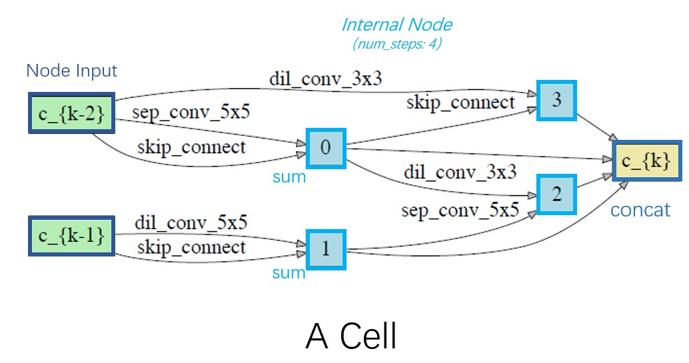

## A breakup of the ENAS configuration

### Component `search_space`

`aw_nas` implement several search spaces, and one can use `awnas registry -t search_space` to see the implemented search spaces.
Here, we mainly explain a **cell-based CNN search space** (type `cnn`, class `aw_nas.common.CNNSearchSpace`), which is compatible to the ENAS, DARTS, FBNet search spaces, as well as many baseline networks (e.g., ResNet, MobileNet, DenseNet) scheme.

``` yaml
search_space_type: cnn
search_space_cfg:
  # Schedulable attributes: 
  num_cell_groups: 2
  num_init_nodes: 2
  num_layers: 8
  cell_layout: null
  reduce_cell_groups:
  - 1
  num_steps: 4
  num_node_inputs: 2
  shared_primitives:
  - none
  - max_pool_3x3
  - avg_pool_3x3
  - skip_connect
  - sep_conv_3x3
  - sep_conv_5x5
  - dil_conv_3x3
  - dil_conv_5x5
  cell_shared_primitives: null
```

* `num_cell_groups` (2): There are `num_cell_groups` types of cells. All cells in the same cell group share the same architecture/topology, but can have different weights after training.
* `num_layers` (8): `num_layers` of cells are stacked together to construct an architecture.
* `reduce_cell_groups` ([1]): The 2nd cell group (2nd cell type) is reduction cell (stride=2).
* `cell_layout` ([0,0,1,0,0,1,0,0]): The 3rd, 6th of the 8 cells are of cell group 1 (reduction cell), others are of cell group 0 (normal cell). This configuration must be specified, except for the case when `num_cell_groups=2, reduce_cell_groups=[1]`, in which case, the reduce cells is by default placed at the position of 1/3 and 2/3, following the ENAS paper.
* `num_init_nodes` (2): there are `num_init_nodes` input nodes in a cell, the rule is: The last `num_init_nodes` cell's output is used as each cell's initial input nodes.
* `num_steps` (4): there are `num_steps` internal node (the node except for the input/output nodes) in the cell.
* `num_node_inputs` (2): Each node in a cell have `num_node_inputs` input nodes.
* `shared_primitives`: The list of operation primitives of all cell groups.
* `cell_shared_primitives` (null): If specified, each cell group has different operation primitives.

Below is an example figure of a cell architecture in the ENAS search space.


You can also run `awnas registry -t search_space -n cnn -v` to check the documentation of the `CNNSearchSpace` class.

And this search space is compatible with the baseline architectures, as long as specific operation primitives are implemented. Thus, we **re-use this search space to implement baseline models** (e.g., ResNets, VGG, MobileNet, DenseNet).
Check the example configurations under `examples/baselines/`, which can all be run with `awnas train`.

### Final Training Configs
To train an architecture, we need to specify several components: `search_space`, `dataset`, `final_model`, `final_trainer`, `objective`. We have already walked through the `search_space` configuration, and the configurations for `dataset`, `objective` and `final_trainer` is easy to understand, you can check any final configs (e.g., `examples/basic/final_templates/final_template.yaml`, `examples/baselines/*.yaml`, etc.). Here we explain the configuration of component `final_model`.

#### Component `final_model`

``` yaml
## ---- Component final_model ----
# ---- Type cnn_genotype ----
final_model_type: cnn_final_model
final_model_cfg:
  # Schedulable attributes: dropout_path_rate
  genotypes:
      CNNGenotype(normal_0=[('skip_connect', 0, 2), ('sep_conv_3x3', 1, 2), ('max_pool_3x3',
      2, 3), ('max_pool_3x3', 0, 3), ('none', 0, 4), ('sep_conv_5x5', 1, 4), ('skip_connect',
      2, 5), ('sep_conv_3x3', 3, 5)], reduce_1=[('max_pool_3x3', 0, 2), ('sep_conv_5x5',
      1, 2), ('max_pool_3x3', 0, 3), ('dil_conv_3x3', 1, 3), ('max_pool_3x3', 0, 4), ('max_pool_3x3',
      2, 4), ('skip_connect', 3, 5), ('max_pool_3x3', 0, 5)], normal_0_concat=[2, 3, 4,
      5], reduce_1_concat=[2, 3, 4, 5])
  use_stem: conv_bn_3x3
  auxiliary_cfg: null
  auxiliary_head: True
  dropout_path_rate: 0.2
  dropout_rate: 0.1
  init_channels: 36
  num_classes: 10
  schedule_cfg:
    dropout_path_rate:
      type: add
      start: 0
      every: 1
      step: 0.000333 # 0.2/600
  stem_multiplier: 3
# ---- End Type cnn_genotype ----
## ---- End Component final_model ----
```

* `genotypes`: The architecture genotype string.
* `auxiliary_head` (True): Whether or not to forward the auxiliary head.
* `use_stem` ("conv_bn_3x3"): The operation of the stem block. If set to false, no stem will be used.
* `init_channels` (36): The initial channel number of the first stage. Upon each stage, the channel number gets doubled while the spatial dimension halves (if no stem is used, `init_channels` should be 3 (RGB)).
* `stem_multiplier` (3): The stem block has `init_channels x stem_multipler` channels.

-----

### Searching Configs
To run NAS, we need to specify several components: `search_space`, `dataset`, `controller`, `evaluator`, `weights_manager`, `objective`, `trainer`, among which the configuration of `search_space` is already introduced above.
Now, let us break up a typical search configuration `examples/basic/enas.yaml` to see how to configure `controller`, `evaluator`, `weights_manager` and `trainer`.

First of all, in a searching configuration file, each component has a `rollout_type` config item in its configuration section, set them to the same rollout type! Some rollout type corresponding examples are (use command ```awnas registry -t rollout``` to see the supported rollout types):
* ENAS - `discrete`
* DARTS - `differentiable`
* NAS-Bench-101 - `nasbench-101`

#### Component `controller`

The controller is responsible for searching in the search space in an efficient way, utilizing the information of previously explored architectures. The method call `controller.sample` samples out architecture rollouts to be evaluated.

`aw_nas` supports several types of controllers, including RL-learned RNNs, differentiable learned ones, population-mutation ones (e.g., evolutionary),  predictor-based ones. In ENAS, RNN sampler that is learned using RL techniques is adopted, and a sample configuration of this `rl` controller is as follows:

``` yaml
## ---- Component controller ----
# ---- Type rl ----
controller_type: rl
controller_cfg:
  # Schedulable attributes: 
  rollout_type: discrete
  mode: eval
  independent_cell_group: false
  # ---- Type embed_lstm ----
  controller_network_type: embed_lstm
  controller_network_cfg:
    # Schedulable attributes: softmax_temperature, force_uniform
    num_lstm_layers: 1
    controller_hid: 100
    attention_hid: 100
    softmax_temperature: null
    tanh_constant: 1.1
    op_tanh_reduce: 2.5
    force_uniform: false
    schedule_cfg: null
  # ---- End Type embed_lstm ----
  # ---- Type pg ----
  rl_agent_type: pg
  rl_agent_cfg:
    # Schedulable attributes: 
    alpha: 0.99
    gamma: 1.0
    entropy_coeff: 0.01
    max_grad_norm: null
    batch_update: true
  # ---- End Type pg ----
# ---- End Type rl ----
## ---- End Component controller ----
```

* TODO: explain `rl` controller!

#### Component `weights_manager`

Given an architecture rollout, the weights manager fills the architecture with weights to construct a **candidate network**. Then, the candidate network is evalauted by the evaluator component.

``` yaml
## ---- Component weights_manager ----
# ---- Type supernet ----
weights_manager_type: supernet
weights_manager_cfg:
  # Schedulable attributes:
  gpus: [0] 
  rollout_type: discrete
  num_classes: 10
  init_channels: 20
  stem_multiplier: 3
  max_grad_norm: 5.0
  dropout_rate: 0.1
  candidate_member_mask: true
  candidate_cache_named_members: true
  candidate_virtual_parameter_only: true
# ---- End Type supernet ----
## ---- End Component weights_manager ----
```

* `init_channels`: The initial channel number of the first stage. Upon each stage, the channel number gets doubled while the spatial dimension halves.
* `stem_multiplier`: The stem block has `init_channels x stem_multipler` channels.
* `gpus` ([0]): The weights manager supports data parallel forwards. Set `gpus` to [1,...,N] and  use `--gpu 0` cmdline argument with `awnas search`.

> Note that, for data-parallel final training, `awnas train` adopts a different scheme and directly accepts `--gpus 0,1,2,3` cmdline arguments.

#### Component `evaluator`

The evaluator outputs the architecture's performances, which is further used to instruct the updates/search of the controller. Here, we use a shared-weights evaluator.

**NOTE that,** here, the shared-weights evaluator is named `mepa`. This is because that we experiment with an extension of the shared-weights evaluator: During the one-shot evaluation of each architecture (sub-network), run several "surrogate" training step on a separate data split (surrogate data queue). However, after careful ablation study and inspection, we find that this technique only brings improvements over the vanilla sw evaluator when there are very little training data (few-shot transferring scenario), or when the supernet training is very insufficient (e.g., only run for 1~10 epochs).

Thus, just set the `controller_surrogate_steps` and `mepa_surrogate_steps` to 0, `surrogate_optimizer` and `surrogate_scheduler` to "null" as in the following sample, then this evaluator is the vanilla shared-weights evaluator.

``` yaml
## ---- Component evaluator ----
# ---- Type mepa ----
evaluator_type: mepa
evaluator_cfg:
  # Schedulable attributes: controller_surrogate_steps, mepa_surrogate_steps, mepa_samples
  rollout_type: discrete
  controller_surrogate_steps: 0
  mepa_surrogate_steps: 0
  surrogate_optimizer: null
  surrogate_scheduler: null
  batch_size: 128
    data_portion:
  - 0.0
  - 0.8
  - 0.2
  shuffle_data_before_split: false
  mepa_optimizer:
    lr: 0.05
    momentum: 0.9
    type: SGD
    weight_decay: 0.0003
  mepa_scheduler:
    eta_min: 0.0
    T_max: 200
    type: CosineAnnealingLR
  mepa_samples: 1
  mepa_as_surrogate: false # only relevant for MEPA, ignore it!
  bptt_steps: 35 # for RNN only
  schedule_cfg: null
# ---- End Type mepa ----
## ---- End Component evaluator ----
```

* `data_portion` ([0.0, 0.8, 0.2]): A list with 3 positive floats that add up to 1. The portion of the surrogate, mepa, and controller queues. As stated above, "surrogate queue" is only used in MEPA evaluator, and should be set to have 0.0 portion data if one wants to use a vanilla shared-weights evaluator. In the sample configuration above, 0.8 of the training data is used to update the shared weights (mepa data queue) in `update_evaluator` calls, while the remaining 0.2 is used in `evaluate_rollout` calls to return the rewards for updating controller.
* `shuffle_data_before_split` (false): Whether or not to shuffle the training set before split according to `data_portion`. Be careful when set it to `true`, since it might introduce some subtle errors as different search runs might use different data splits.
* `mepa_optimizer`: The optimizer of the shared weights in the supernet. The `type` should be an optimizer class name in `torch.optim` (e.g., "SGD" here, can be "Adam", etc.). And other items in the dict will be fed as keyword arguments to initialize the optimizer (e.g., `{"lr": 0.05, "momentum": 0.9, "weight_decay": 0.0003}` here).
* `mepa_scheduler`: The learning rate scheduler of the shared weights in the supernet. The `type` should be an lr scheduler class name in `torch.optim.lr_scheduler` (e.g., "CosineAnnealingLR" here), or one of `["WarmupCosineAnnealingLR", "CosineWithRestarts", "ExpDecay"]`, which are implemented in `aw_nas` (See `aw_nas/utils/lr_scheduler.py`). And, other items in the dict will be fed as keyword arguments to initialize the scheduler.
* `mepa_samples`: Numbers of architecture Monte-Carlo samples in every supernet training step.

**NEW!!!**: NOTE that, for the ease of understanding, we have simplified the `mepa` evaluator by removing the tedious and redundant codes related to conducting surrogate steps: `discrete_shared_weights` and `differentiable_shared_weights` evaluators. See `evaluator/shared_weights.py`. Also, you can run `python scripts/convert_cfg_mepa2sw.py <old cfg> <new cfg>` to convert an old cfg that uses `mepa` evaluator into new cfg files. For example, you can run `python scripts/convert_cfg_mepa2sw.py examples/mloss/enas/enas_search.yaml examples/mloss/enas/enas_search_cvt.yaml`, and then run `awnas search examples/mloss/enas/enas_search_cvt.yaml`. These two options should be equivalent.

#### Component `trainer`

A trainer is responsible for orchestrating the search process, i.e., passing the rollouts between the components and calling corresponding methods.

```yaml
## ---- Component trainer ----
# ---- Type simple ----
trainer_type: simple
trainer_cfg:
  # Schedulable attributes: controller_samples, derive_samples
  rollout_type: discrete
  epochs: 200
  test_every: 10
  derive_samples: 10
  evaluator_steps: null
  controller_steps: null
  controller_samples: 1
  controller_optimizer:
    lr: 0.001
    type: Adam
  controller_scheduler: null
  controller_train_every: 1
  controller_train_begin: 1
  interleave_controller_every: null
  schedule_cfg: null
# ---- End Type simple ----
## ---- End Component trainer ----
```

* `test_every` (10), `derive_samples` (10): Run derive once every `test_every`. In this method call, `derive_samples` architectures will be sampled from the controller, and evaluated on the whole "controller queue" instead of one batch from the queue (during training).
* `evaluator_steps` (null), `controller_steps` (int): If None, (not explicitly given), assume every epoch consume one pass of the mepa/controller queue, respectively. If no data queues are used in the evaluator, then these two configs must be explicitly given.
* `controller_optimizer`: The optimizer for optimizing the controller. If the controller does not need an optimizer (e.g., evolutionary controller), one can set it to "null". This configuration works in the same way as the `mepa_optimizer` configuration of `mepa` evalautor above.
* `controller_scheduler`: The learning rate scheduler for optimizing the controller. This configuration works in the same way as the `mepa_scheduler` configuration of `mepa` evalautor above.
* `controller_samples` (1): If >1, call `controller.sample` and `controller.update` with multiple rollouts at a time.
* `controller_train_every` (1): Only update controller every `controller_train_every` epoch.
* `controller_train_begin` (1): Only update controller from Epoch `controller_train_begin`.
* `interleave_controller_every`: Interleave controller update steps every `interleave_controller_every` steps. If None, do not interleave, which means in each epoch, the controller is updated after the shared-weights updates on the whole "mepa queue". In ENAS, in every search epoch, the shared weights are updated on the "mepa queue" for one epoch, and then the RNN controller is updated on the "controller queue" for one epoch. While in DARTS, following each shared-weights update, a controller update takes place. Thus, the trainer configuration of DARTS differs with the above configuration as follows (Compare with `examples/basic/darts.yaml`):

``` yaml
  rollout_type: differentiable
  epochs: 50
  controller_optimizer:
    lr: 3.e-4
    betas: [0.5, 0.999]
    weight_decay: 1.e-3
    type: Adam
  controller_scheduler: null
  interleave_controller_every: 1
```
